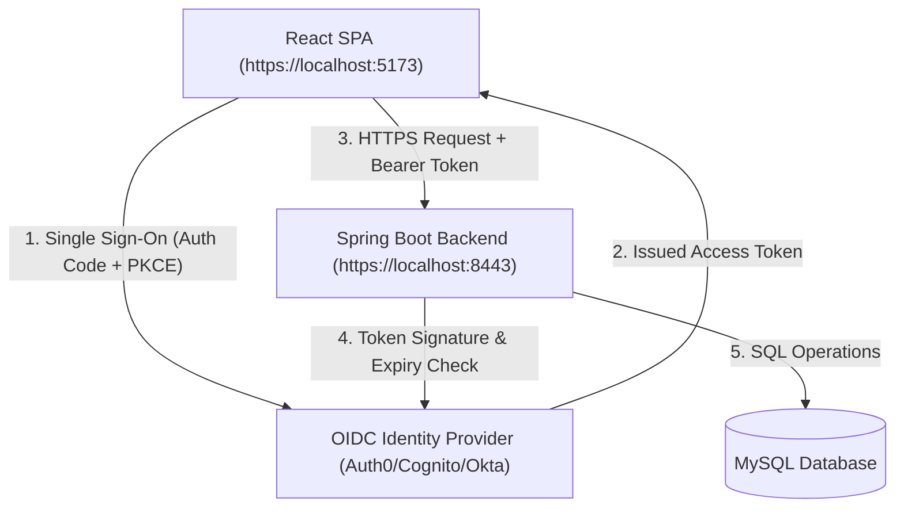
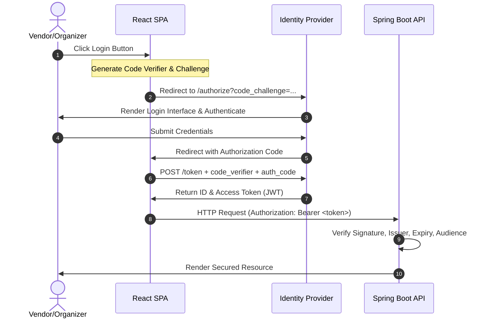
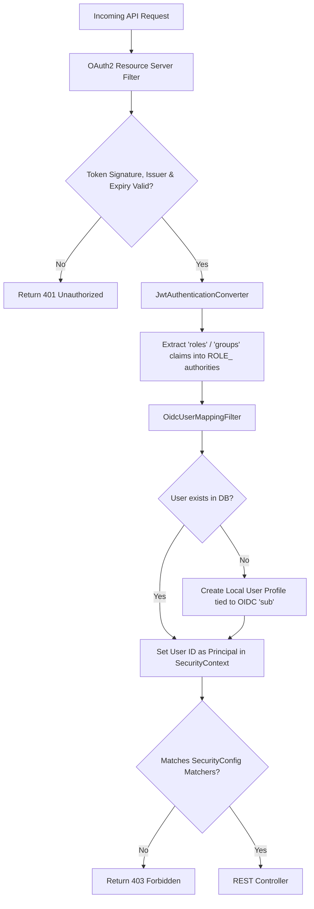

# Security Architecture Design

This document details the security architecture of the Stall Reservation System, illustrating the secure integration of OIDC, token-based authentication, backend role-based access control (RBAC), and database protections.

---

## 1. Overall System Architecture
The application runs as a secure decoupled system using standard web security protocols:

---

## 2. Authentication Flow (OIDC + PKCE)
Authentication is delegated entirely to the cloud Identity Provider using OAuth2.0 / OpenID Connect authorization code flow with Proof Key for Code Exchange (PKCE) to prevent interception attacks:

---

## 3. Token Processing & Role Authorization (Backend)
Once an authenticated request arrives at the Spring Boot backend, it runs through the Spring Security Filter Chain:

---

## 4. End-to-End Encryption & CORS Constraints
*   **HTTPS/TLS**: Both the React dev server and the Spring Boot backend are configured to enforce TLS 1.3 to encrypt traffic in transit.
*   **Restricted CORS**: Wildcard origins are disabled. Only configured origins (e.g. `https://localhost:5173`) are allowed to send authorization headers and read response bodies.
